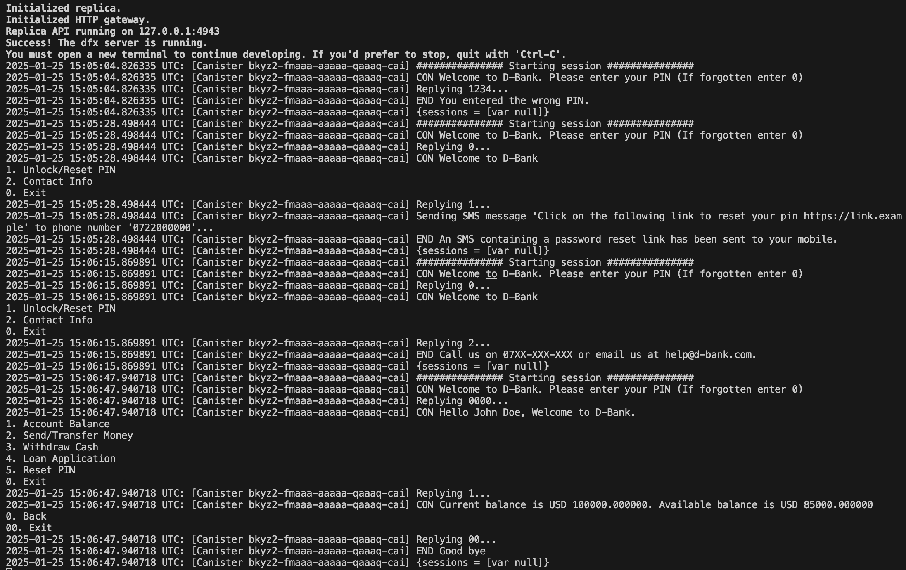

# Example

This example project showcases how to use the `ussd-menu-builder` library to build a ussd menu. It builds a simple ussd menu for a banking app.

In the actor defined in the `main.mo` file, the following 4 shared update functions, simulate various menu scenarios:

- `wrongPin` function simulates the menu scenario in which a user logs in with a wrong pin.
- `resetPin` functions simulates the menu scenario where a user decides to reset their pin.
- `contactUs` functions simulates the menu scenario where a user decides to request for contact info, because they have forgotten their pin.
- `accountBalance` functions simulates the menu scenario where a user after successful login, decides to check their bank account balance.

In a real world implementation of a USSD app, one would use the [HTTP incall](/https://internetcomputer.org/docs/current/developer-docs/smart-contracts/advanced-features/handling-get-post-requests) feature of the IC, to expose the menu to the outside world/USSD gateway. The args are built from incoming HTTP request data, and passed to the `runMenu` function of the library.

Below is a screenshot of the logs resulting from testing out the above actor functions locally.

